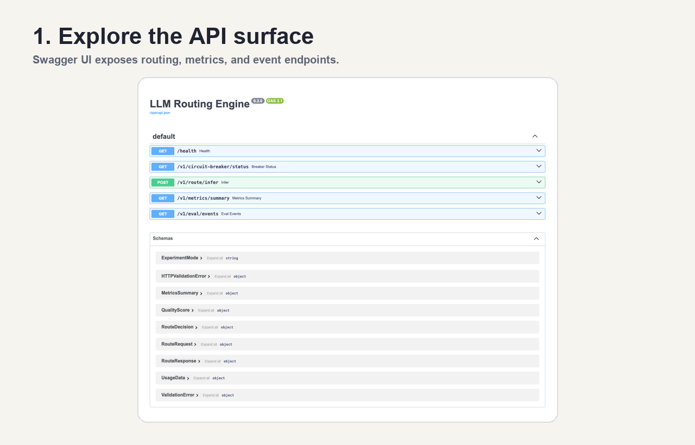
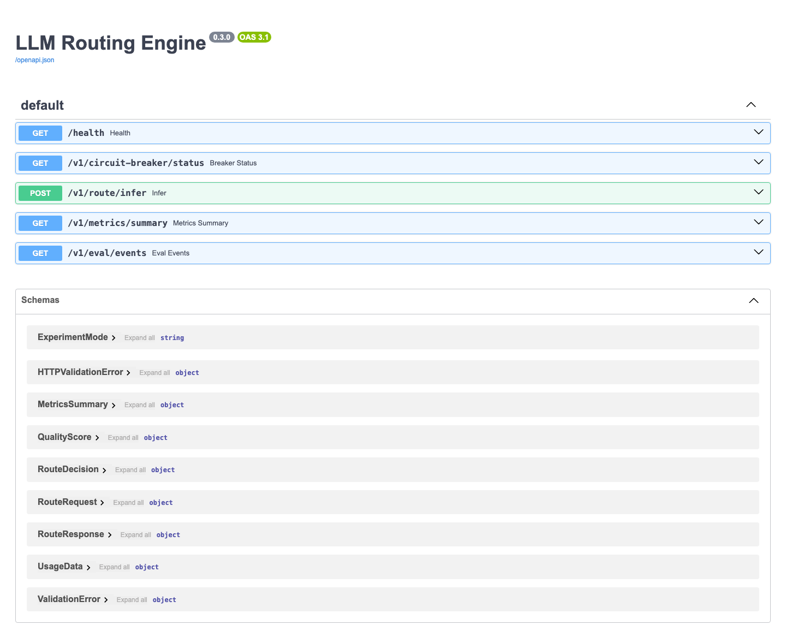
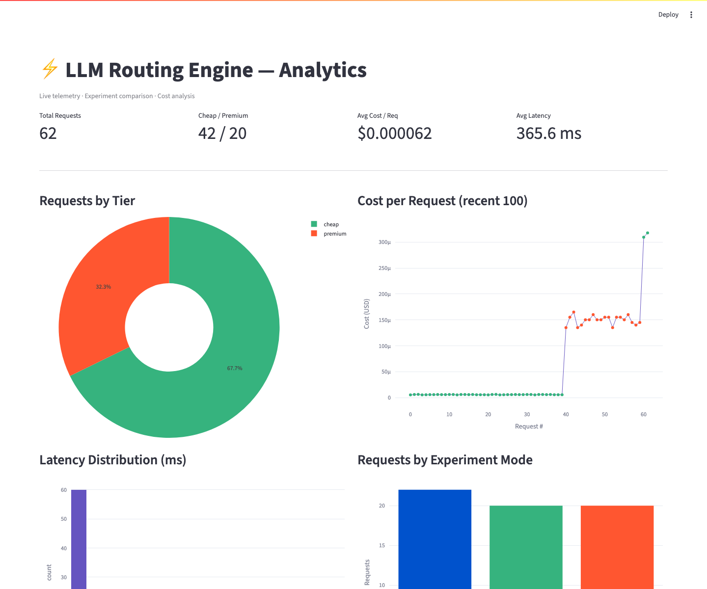

# LLM Routing Engine

<p align="center">
  
  
  
  
</p>

Policy-driven LLM routing for teams that need to reduce inference cost without blindly downgrading model quality. The service scores prompt complexity, selects a cheap or premium model tier, executes through reliability guards, and records telemetry for cost, latency, tokens, routing decisions, fallback behavior, and quality proxy signals.

The core engineering question is simple: **does this request really need the expensive model?**



## Why This Repo Matters

Most LLM demos hard-code one model. Production systems need routing policy, cost accounting, provider fallback, evaluation, and observability. This repo demonstrates those concerns as a backend service rather than a chat UI.

It is designed to show practical AI engineering judgment:

- route simple prompts to cheaper models
- escalate complex prompts to premium models
- compare routing policy against baseline strategies
- expose reason codes for routing decisions
- track spend, latency, token usage, fallback rate, and provider behavior
- support mock, local, and hosted model providers behind one contract

## What It Does

| Capability | Production behavior |
|---|---|
| Complexity scoring | Weighted prompt heuristic with explicit reason codes |
| Model routing | `cheap` or `premium` tier selected by policy threshold |
| Experiments | `router_v1`, `always_cheap`, and `always_premium` modes |
| Reliability | Retry, circuit breaker, and cheap-to-premium fallback |
| Telemetry | SQLite-backed request events with cost, latency, usage, and mode |
| Evaluation | 50-prompt benchmark for routing accuracy and cost comparison |
| Dashboard | Streamlit analytics for tier mix, spend, latency, and experiments |
| Provider abstraction | Mock, Ollama, OpenAI, and Anthropic providers |

## Architecture

```text
Client
  -> POST /v1/route/infer
  -> complexity scorer
  -> routing policy
  -> provider contract
  -> retry + circuit breaker
  -> fallback when needed
  -> telemetry + quality proxy
  -> response with route, cost, usage, latency, and request_id
```

## Benchmark Snapshot

The included benchmark compares the router against two baselines. These numbers use the bundled mock provider and configured token prices; they validate policy behavior and cost math, not real-model answer quality.

| Policy | Routing Accuracy | Cost / 50 Requests | vs Always Premium |
|---|---:|---:|---:|
| `router_v1` | 80.0% | $0.004313 | -65.6% |
| `always_cheap` | 60.0% | $0.000465 | -96.3% |
| `always_premium` | 40.0% | $0.012525 | baseline |

Takeaway: forcing every prompt to the cheapest model is not cost optimization. The point is to reduce spend while preserving acceptable routing quality.

## Product Surfaces

### API and Swagger

The FastAPI app exposes an inspectable OpenAPI surface for manual testing and integration.



### Analytics Dashboard

The Streamlit dashboard turns telemetry into request mix, latency, cost, provider, and experiment views.



## Quick Start

```bash
git clone https://github.com/manjeetkumar53/llm-routing-engine.git
cd llm-routing-engine

python3.13 -m venv .venv
source .venv/bin/activate
pip install -r requirements.txt

uvicorn app.main:app --reload
```

Open:

- API docs: `http://127.0.0.1:8000/docs`
- Health: `http://127.0.0.1:8000/health`

Example request:

```bash
curl -s -X POST http://127.0.0.1:8000/v1/route/infer \
  -H "Content-Type: application/json" \
  -d '{"prompt":"Design a scalable event-driven microservice architecture for a fintech platform."}'
```

## API Surface

| Endpoint | Purpose |
|---|---|
| `POST /v1/route/infer` | Route a prompt and return completion, cost, usage, quality, and routing details |
| `GET /health` | Service liveness |
| `GET /v1/metrics/summary` | Aggregate metrics by tier and experiment mode |
| `GET /v1/eval/events` | Raw telemetry events for offline analysis |
| `GET /v1/circuit-breaker/status` | Current breaker state |
| `GET /docs` | Swagger / OpenAPI UI |

Core response fields:

```json
{
  "request_id": "3f8a2c14-91e7-4b2d-bc43-7a1d9e204f88",
  "route": {
    "selected_tier": "premium",
    "complexity_score": 0.725,
    "reason_codes": ["complexity_hints_present", "threshold=0.5"]
  },
  "usage": {
    "input_tokens": 24,
    "output_tokens": 187
  },
  "latency_ms": 312.5,
  "estimated_cost_usd": 0.00003125,
  "fallback_used": false,
  "experiment_mode": "router_v1",
  "quality": {
    "total": 0.927,
    "acceptable": true
  }
}
```

## Provider Modes

Provider selection is environment-driven:

| Provider | Use case |
|---|---|
| `mock` | Deterministic local development and tests |
| `ollama` | Local LLM testing without hosted API keys |
| `openai` | Hosted OpenAI model routing |
| `anthropic` | Hosted Anthropic model routing |

Example:

```bash
export LLM_PROVIDER=ollama
export OLLAMA_CHEAP_MODEL=llama3.2:1b
export OLLAMA_PREMIUM_MODEL=llama3.1:8b
uvicorn app.main:app --reload
```

Cost reporting is controlled by pricing env vars:

```env
CHEAP_INPUT_PRICE_PER_1M=0.15
CHEAP_OUTPUT_PRICE_PER_1M=0.60
PREMIUM_INPUT_PRICE_PER_1M=5.00
PREMIUM_OUTPUT_PRICE_PER_1M=15.00
```

## Validation

```bash
pytest -q
python -m benchmark.run
streamlit run dashboard/app.py
```

The test suite covers complexity scoring, routing behavior, reliability guards, evaluation math, and API behavior.

## Design Decisions

- **Rule-based scoring first:** transparent, cheap, deterministic, and inspectable through `reason_codes`.
- **Provider contract:** the router stays independent of individual SDKs.
- **SQLite telemetry:** simple local setup while preserving enough request history for analysis.
- **Quality proxy:** lightweight inline feedback without paying for an extra judge model call.
- **Benchmark baselines:** `always_cheap` and `always_premium` provide context for whether routing is useful.

## Project Structure

```text
llm-routing-engine/
├── app/
│   ├── config.py
│   ├── experiment.py
│   ├── main.py
│   ├── reliability.py
│   ├── router.py
│   ├── providers/
│   └── services/
├── benchmark/
│   ├── prompts.json
│   ├── results.json
│   └── run.py
├── dashboard/
├── scripts/
├── tests/
├── assets/
└── README.md
```

## Production Hardening Backlog

- Add persisted experiment registry and rollout percentages
- Add LLM-as-judge or human-labeled quality evaluation
- Add Prometheus/OpenTelemetry exporters
- Add per-tenant budgets and routing policies
- Add CI gate for routing benchmark regressions
